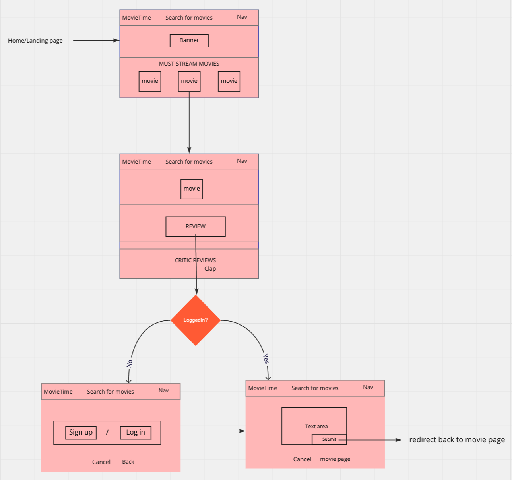
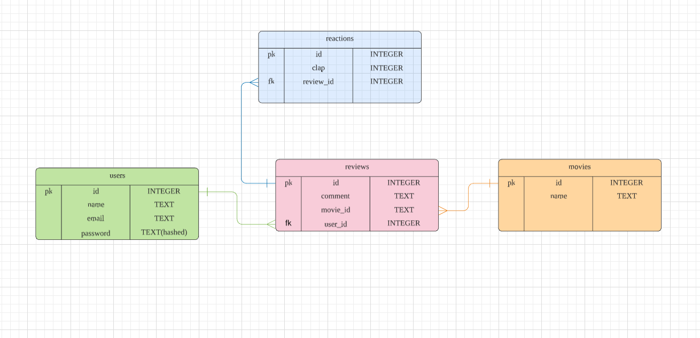

# 🍿 MovieTime

A movie rating app.

## ⚙️ Technologies

### 👥 Client-side

- React
- AJAX
- Webpack

### 💡 Server-side

- Node.js/ Express
- PostgreSQL/ Sequelize ORM

### ☁️ Deployment

- Heroku

## 🎬 Features

- User login
- Read reviews/comments on a particular film/short.
- Post comments.
- Clap on other's comments.

## User story

## ERD

